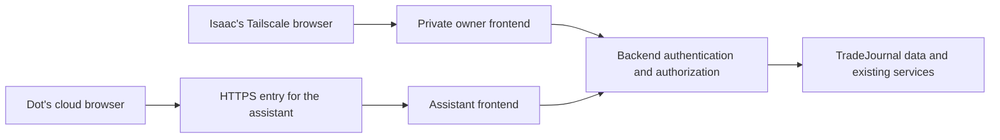

# Cloud browser access: authentication and permissions contract

**Chunks 1–2, 2026-10-08: design and private implementation.** Selected to let an AI use the
actual TradeJournal UI with Isaac's laptop closed. Authentication code and fixture tests are present; no live assistant
credential, public address, deployment or schedule has been activated. The current private deployment rules remain in force until a
separately reviewed implementation and explicit exposure approval.

## The user experience

Isaac continues opening TradeJournal through Tailscale, without an extra login.
The Dot opens a separate HTTPS address and signs in with a dedicated,
revocable TradeJournal credential. Both entrances use the same application
components; the server limits what each identity can see and do.

The first trial uses a separate installation with sample data. The Dot must
actually navigate Charts, Today and review pages, then report friction with
page names and concrete examples. Code access, fetched HTML, API-only calls
and exported screenshots do not establish that the Dot used the app.

The first trial is read-only. Writing an AI's own draft decisions is the next
permission increment. Independent Shadow Isaac decisions require a separate
runner without personal Dot memory or human choices. A personal Dot that
reviews Isaac's journal is a coach/inspector, not a blind comparator.

## Decisions settled in this chunk

| Question | Decision |
|---|---|
| Does Isaac need another login? | No. Retain private, owner-only Tailscale access. |
| Does the Dot join the tailnet? | No requirement. Its browser reaches a separate authenticated HTTPS entrance. |
| What authenticates the Dot? | A dedicated assistant ID plus a generated high-entropy app access key, entered through the supported private website sign-in flow. |
| Does the Dot receive Isaac's account or Gmail credentials? | No. Its app credential has only its own grants. |
| Where are permissions checked? | At the backend before loading data or starting work, including field/resource ownership checks. |
| Can the public frontend act as the owner? | No. It has no private owner bootstrap credential or unrestricted backend credential. |
| What is enabled first? | Sample-data browser inspection with read-only grants. |
| What counts as successful connectivity? | An observed Dot cloud-browser login and real UI navigation with Isaac's laptop offline. |
| Does this enable paper trading or change the universe? | No. Arming, scheduled preparation, model spending and the MU/NBIS policy revision remain separate work. |

## Current code and the gaps it creates

Inspection baseline: commit `f23faac` in this checkout, not a fresh production
verification.

- [Deployment access](../../deploy/README.md#access-and-layout) keeps the
  frontend and backend on loopback. Tailscale Serve reaches the frontend;
  browser requests use the same-origin backend proxy.
- [Frontend rewrites](../../frontend/next.config.js) forward arbitrary backend
  paths to a fixed loopback origin. They contain no session or permission check.
- [API URL selection](../../frontend/lib/api.ts) sends server-rendered page
  reads directly to the internal backend. Those reads currently carry no
  authenticated user. A shared owner token here would grant public pages
  owner access.
- [Gmail OAuth routes](../../backend/app/routers/auth.py) authorize mailbox
  integration, not app users. Preserve that separation; do not reuse a Gmail
  refresh token for login.
- [Today](../../frontend/app/page.tsx) fetches trades, statistics, accounts and
  decisions before rendering its practice components. The
  [app layout](../../frontend/app/layout.tsx) also includes a Gmail status
  banner. They must avoid forbidden reads before rendering a restricted view.
- [Charts](../../backend/app/routers/charts.py) adds execution markers,
  positions and all level alerts to market data. Historical chart reads also
  attach markers. A market-read grant cannot authorize these combined
  responses unchanged.
- [Symbol information](../../backend/app/routers/symbol_info.py) includes a
  journal-specific "you" endpoint. Market and journal access are different grants.
- [Practice routes](../../backend/app/routers/practice.py) are owner UI
  operations: choices, reveal, timing and feedback. An assistant must not
  write through the human-choice path or claim human timings/phone receipt.
  The current practice view also repairs interrupted run/call state while
  reading it; a read-only assistant projection must avoid that mutation.
- [Decision routes](../../backend/app/routers/decisions.py) accept a caller's
  actor label; [A3 visibility](../../backend/app/engine/practice.py) handles
  reveal timing without authenticating an external principal. Preserve its
  reveal rules and add authorization rather than treating them as cloud isolation.
- [Health](../../backend/app/routers/health.py) includes deployment/database
  identity. Anonymous liveness must not return that information.
- [Local MCP](../../backend/mcp_server.py) has broad journal capabilities and
  unauthenticated HTTP calls. It is not the Dot's credential or public interface.

## Two entrances and one backend authority

Run two separately configured frontend instances from the same application
build on distinct loopback listeners. The private one remains reachable only
through owner-restricted Tailscale Serve. The assistant one has a separately
reviewed TLS ingress and fixed configured hostname. The API and database keep
loopback bindings; neither is an internet listener.

Replace the unrestricted browser rewrite with a bounded same-origin request
handler. It forwards only classified routes to a fixed backend origin,
preserves legitimate session/CSRF information, and strips caller-supplied
principal, capability and trusted-ingress headers. It cannot choose an
upstream from a URL, Host header or request parameter. Redirects, response
cookies, body limits, uploads, streaming and encoded/normalized paths need
explicit handling and tests; it is not an arbitrary HTTP proxy.

The backend authenticates the frontend's server-side ingress credential as
well as the browser session. The public ingress credential permits session
transport only; it confers no owner or domain-data access by itself. The
private ingress credential alone may bootstrap an owner session for browsers
arriving through that dedicated listener. It is inaccessible to the public
frontend. Owner bootstrap is not a public login option or a role in a request.

Separate service configuration, secret files and process permissions are
required. A client cannot select the private mode using a hostname, forwarded
IP, role field or header. Loopback is a network binding, not user identity.
Every backend route still checks a session or a separately scoped service
capability. Do not leave anonymous "local" administrative routes reachable
through the public request handler.

Authenticated frontend/backend profiles fail closed when their credentials or
origin configuration are missing. Development startup, browser fixtures and
deployment probes need explicit private/test configuration; an environment
label, request header or failed login cannot turn authentication off.

Server-rendered reads forward the current request's authenticated session and
correct ingress identity. Client bundles contain no service credentials. Use
a server-only request adapter rather than importing server secrets into the
shared browser API helpers. Prevent protected page pre-rendering/shared caching;
HTML, React server-component payloads, downloads and API responses must obey
the same access policy. Missing identity never falls back to owner access.

## Login, sessions and revocation

No public signup, role selector or self-service permission escalation. Isaac
creates or disables an assistant identity through the private owner entrance;
a private administrative command is the recovery/bootstrap path. Public login
cannot create principals or accept an arbitrary actor.

Generate a random 32-byte assistant access key. Display it once in the private
owner UI, then store only a password hash using a maintained Argon2id library
and reviewed parameters. The Dot receives it through the supported private
sign-in form or browser takeover, never chat, a URL, a repository file or a
tool log. A reset replaces the credential and invalidates all its sessions.
There is no owner Google/password login to implement for this selected design.

Persist opaque browser sessions server-side, linked to principal, credential
version, ingress audience, creation time, absolute expiry and last activity.
Store only the digest of a cryptographically random session token. Production
cookies are host-only, Secure, HttpOnly, SameSite=Lax with Path=/ and no Domain.
Each entrance has its own cookie audience; a private-owner session cannot be
used through the assistant entrance. No browser localStorage bearer tokens.

Initial limits to implement: assistant sessions expire after seven days or
24 hours idle; assistant credentials expire after 30 days unless renewed by
the owner. Private-owner sessions expire after 12 hours or two hours idle and
can be silently re-established through the private Tailscale entrance. No
background call can extend the absolute lifetime. These are selected product
limits, not observed Dot session behavior; adjust only through a versioned
configuration and a new live login test.

Rate-limit login by normalized identity and observed connection source with
persistent, bounded backoff. Unknown identity and wrong key receive the same
generic response. Never trust forwarded source headers from the browser.
Cap request size, failed-attempt retention and active sessions per identity.
Login, logout, grant changes and credential management need CSRF protection;
the login page gets a short-lived pre-session challenge. Cookie-authenticated
mutations require a session-bound CSRF token and exact allowed Origin checks.
SameSite cookies are an additional layer, not the entire defense.

Do not change domain state through GET. Audit existing GET routes for generated
reports, model/provider calls or hidden writes; a read grant may permit
bounded market-cache refresh, not paid model execution or economic mutations.
In particular, separate practice read serialization from interrupted-run
recovery before granting inspector reads. Preserve that recovery in the
authorized owner/job path rather than letting inspection alter run evidence.
Requests without Origin require an explicit non-browser capability policy,
not a generic CSRF bypass.

Revocation disables the credential/principal and invalidates sessions on the
next request. SSE streams recheck authorization at least every 15 seconds
and close on revocation/expiry; tests must exercise an already-open stream.
Permission reductions invalidate sessions too. Do not rely on a long-lived
signed token whose grants cannot be withdrawn.

## Permission and data contract

Permissions are operation plus resource/field checks, not only role names.
Every route is classified; unclassified routes are denied. Authentication
failures are 401, forbidden operations 403, and inaccessible record IDs use
the same 404 as nonexistent IDs. Authorize before reading a record, invoking a
provider, constructing a response or submitting a job.

| Identity or grant | Allowed | Denied |
|---|---|---|
| Owner through the private entrance | Existing owner workflows, assistant credential/grant administration | Unauthenticated access through the public entrance |
| Assistant inspector: market read | Bounded charts, symbol facts/news and market packets for its configured symbols | Journal markers/positions, account-derived watchlists, saved private chart settings, arbitrary symbol/provider expansion |
| Assistant inspector: selected practice review | Specifically granted runs, committed human decisions and already-revealed agent results, with original evidence and paper events | Hidden agent outputs/raw model payloads, unrelated records, changing choices/reveal/timing/ratings/arming |
| Optional journal read | Selected journal read pages/fields when Isaac separately grants it; enabled only over sample data in the first trial | Import/rebuild/resync, editing fills/tags/reviews, account administration, Gmail/Webull configuration, source email bodies, unrestricted attachments |
| Future assistant draft writer | Own context and immutable own TAKE/WAIT/SKIP records through validated operations | Human-choice routes, forged actor/context IDs, journal writes, automatic arming, discretionary paper amendments |
| Future independent Shadow Isaac principal | Approved frozen market/policy input and its own committed records | Human choices, personal Dot memory, journal/coaching data and inspector credentials |
| Internal service capability | Explicit operations necessary for that named local service | Being accepted as an owner browser session or reaching additional routes through caller-supplied identity |

The initial inspector has no write grant. Its improvement suggestions remain
in its conversation for review; this slice does not add a proposal database
or automatically delegate/implement upgrades. Any future writer is explicitly
enabled and separately tested. The authenticated principal determines actor
server-side. New ownership metadata must not rewrite existing immutable
decision/evidence hashes; pre-authentication rows remain legacy owner/internal
runner records, never implicitly owned by a caller matching their actor string.

For assistant market-only views, remove journal-bearing fields before querying
or serializing. Do not return them and hide them with CSS. Avoid loading them
in server components, layout banners, prefetches, drill-downs or SSE messages.
Absent data/permission is visible as unavailable/restricted, not zero or an
empty trading history. Shared chart settings cannot be overwritten as a
side-effect of navigation; use browser-local assistant view preferences first.

## Route coverage required in chunk 2

This is the required implementation audit, not an existing access manifest.
Keep the eventual manifest exhaustive against FastAPI's registered routes.

| Current surface | Required treatment |
|---|---|
| Owner dashboard and daily review | Branch reads by grant before fetching trades/accounts; preserve owner deep links and normal private use |
| Chart workspace/history/stream, symbol panel | Separate market data from journal, saved settings and alert data; bound provider work and stream lifetime |
| Practice and decisions | Preserve A3 reveal rules; enforce selected-run access, record/context ownership and server actor attribution |
| Accounts, fills, trades, stats, market-context audit | Owner-only by default; optional read grant has an explicit field/resource projection |
| Sync, rebuild, enrichment, Webull controls, Gmail watch | Owner or specifically named local service only; no assistant job or integration administration |
| Gmail OAuth and push | Private owner/service boundary; preserve state/callback validation and listener ownership; no new public callback/push exception in this project |
| Captures/audio/images | Owner-only initially, including downloads and upload/transcription routes |
| Research, Strategy Lab, Signals | Owner-only initially; no factory/research writers implied by inspection |
| Health, API docs/OpenAPI, errors | Public liveness has no environment/database/release details; documentation and detailed diagnostics stay private |
| Frontend static assets and login | Public allowlist only for inert assets and authentication; no protected generated artifacts or user data |
| MCP, launch scripts, deployment probes | Assign necessary scoped service identities, preserve local operation; never hand broad owner MCP to the Dot |

Audit credential/error-bearing response fields as well as routes. A backend
exception, OAuth authorization URL, worker message or integration failure must
not accidentally reveal secrets through an allowed page.

## Persistence and implementation ownership

The backend owns principals, credentials, grants, session validation and
revocation. Migrations add that metadata and bounded audit records; deployment
uses the existing restricted application database role and Alembic process.
The frontend only presents login, private assistant administration, permission
states and authenticated requests. There is no second TradeJournal data store.

Audit credential creation/reset/revocation, successful/failed login, denials,
grant changes and authorized mutations with principal, operation, resource ID,
request ID, time and result. Preserve domain idempotency receipts. Do not log
keys, passwords, cookies, CSRF tokens, full input packets or raw email content.
Rate-limit denial logging and define retention before deployment.

Private workers and A3's tool-free model payload remain isolated from browser
sessions. Any HTTP client gains only the service credentials it needs;
in-process domain calls do not pretend to be a browser. Auth failure cannot
pause deterministic monitoring of existing paper positions. Optional model
execution remains disabled/budgeted under its existing contract.

## Four chunks and their completion evidence

1. **Design complete.** Code-grounded access map, owner Tailscale continuity,
   separate assistant identity, session/permission contract and explicit gates.
2. **Private implementation built; verification evidence below.** Authentication, exhaustive route authorization,
   restricted UI/server reads, owner bootstrap, revocation/auditing, migrations
   and deployment packaging. Public ingress ships disabled. Complete negative
   request/resource tests, SSR/RSC/prefetch leak tests, CSRF/replay tests,
   cross-ingress tests, active-stream revocation, owner/MCP/job regressions,
   full local verification and Postgres/native Ubuntu CI.
3. **Sample-data Dot trial.** Separately approved HTTPS test installation with
   a different database, hostname, credentials and session audience from
   production. No copied real fills/email/OAuth or live import/listener
   identity; providers are fixtures initially and paid calls/arming/scheduling
   stay disabled. Observe cloud-browser sign-in, Charts navigation, Today
   evidence reopening and review, a denied mutation, logout/re-login and
   revocation with the laptop offline. Record concrete UX suggestions and the
   exact browser/environment used. Stop if secure sign-in or browser access
   fails; do not treat server-side requests as a substitute.
4. **Live access.** Review exact granted pages/data, hostname/TLS/ingress
   configuration, backups/migrations, worker health and recovery procedure.
   Obtain explicit exposure/deployment approval. Verify anonymous denial,
   private-owner continuity and an actual Dot browser session against the live
   service. Initially enable only the selected inspector grants. Own-decision
   writes, independent runner access and arming are separate increments.

Never roll back to unauthenticated code while retaining public ingress. The
first recovery step disables the assistant entrance and revokes its sessions;
private owner access and monitoring must survive. Test that ordering on the
sample installation before live exposure.

## Remaining setup inputs and boundaries

- Select an available HTTPS hostname and TLS ingress configuration at chunk 3;
  none is purchased or provisioned by this design.
- Verify the Dot's private sign-in flow, browser functionality and session
  behavior in a real trial. Its reported private-network limitation is not
  proof that an authenticated HTTPS site works.
- Inspect the production version/configuration before rollout. The local
  baseline is not production evidence.
- Keep MU/NBIS as requested universe-change scope, with provider checks and a
  new complete practice-policy version; auth does not silently change P0.
- Application authorization cannot remove information from a personal Dot's
  memory. A later independent runner needs verified isolation and a separate
  service principal. This project does not claim that separation already exists.

## Primary references

- [OWASP authorization](https://cheatsheetseries.owasp.org/cheatsheets/Authorization_Cheat_Sheet.html):
  least privilege, default denial and per-request/resource checks.
- [OWASP session management](https://cheatsheetseries.owasp.org/cheatsheets/Session_Management_Cheat_Sheet.html):
  protected cookies, expiry, session handling and invalidation.
- [OWASP CSRF prevention](https://cheatsheetseries.owasp.org/cheatsheets/Cross-Site_Request_Forgery_Prevention_Cheat_Sheet.html):
  session-bound tokens and origin checks for browser mutations.
- [OWASP password storage](https://cheatsheetseries.owasp.org/cheatsheets/Password_Storage_Cheat_Sheet.html):
  maintained password hashing rather than storing reusable access keys.
- [Dots computers and apps](https://learn.chatgpt.com/docs/dots/computers-and-apps):
  separate cloud browser sessions and private website sign-in. This is a
  capability description, not evidence of a connection to TradeJournal.

## Chunk 2 implementation and evidence

Backend authority is [access.py](../../backend/app/engine/access.py), the
[route inventory](../../backend/app/access_manifest.py),
[ASGI boundary](../../backend/app/access_middleware.py) and
[app access routes](../../backend/app/routers/access.py). The
[migration](../../backend/alembic/versions/b1a7c8d9e201_add_browser_access.py)
adds principals, sessions, persisted rate budgets and bounded security audits.
The inspector has a 240-request/minute budget including session checks;
registered operations and symbol/run/record restrictions are enforced before
provider or protected domain reads, including the chart's Insiders endpoint.
Actor attribution on authenticated A1 writes is server-derived: owner browser
writes are `human`, and the scoped manual MCP service writes are
`agent:manual_mcp` regardless of the caller's actor field. Existing immutable
records and hashes are not rewritten; legacy private mode retains its previous
actor behavior. Assistant browser writes remain denied.

Frontend enforcement is [proxy.ts](../../frontend/proxy.ts),
[request forwarding](../../frontend/lib/backendProxy.ts),
[server session handling](../../frontend/lib/accessServer.ts) and
[server API transport](../../frontend/lib/serverApi.ts). The app layout forces
per-request rendering. Restricted Today/review navigation and market chart
responses use the existing components with owner controls denied/disabled;
assistant chart settings never read/write private shared settings. Owner
credential administration is the private `/access` page. The assistant
[login page](../../frontend/app/login/page.tsx) uses the dedicated key and a
single-use login challenge. Keys are hashed with Argon2id and never included
in audit records; login validation errors cannot reflect credentials through
the frontend. Streaming request bodies are bounded before forwarding.

[Configuration generation](../../deploy/access-config.py) separates secrets,
keeps assistant enablement false, and installs no network ingress.
The [optional assistant unit](../../deploy/systemd/tradejournal-assistant.service)
has a separate OS identity and cannot read private configuration/state.
Private automated clients and local MCP accept only their named capabilities.
Optional auth files are included in existing protected backup archives.

Initial focused evidence: 110 backend security/deployment/decision checks
passed; migration compatibility fixes and 33 focused follow-up checks passed.
The initial two authenticated real-browser fixture scenarios passed after
correcting protected-page caching. They observed assistant login, restricted
Today/Charts/review, owner UI, CSRF denial, revocation and owner-cookie replay
denial against the actual backend. Final full-suite results are recorded after
verification, not inferred from these focused checks. No Dot cloud computer,
production provider, live TLS endpoint, actual Tailscale connection or native
Ubuntu sandbox was exercised locally. Postgres/native checks are prepared for
CI and remain unobserved until that run.

The native deployment pipeline additionally invokes
[auth-smoke.py](../../deploy/auth-smoke.py) only on its root, explicitly
marked disposable CI host and named fixture database. It exercises owner and
assistant sessions against the actual packaged processes, checks the assistant
listener is loopback-only, probes denied private-file reads inside its actual
mount namespace/dynamic UID, and verifies revocation. It restores assistant
enablement to false and stops the unit. This native trial is prepared but has
not run locally; fixture guard tests prove it refuses other environments and
database identities before configuration changes.

### Final local verification

The complete isolated `scripts/verify.sh` run passed backend/deployment lint,
import boundaries, **1,643 backend tests (33 skipped)**, frontend typecheck,
lint/build, **193 ordinary browser tests** and **three authenticated browser
scenarios**, including phone-width rendering. The phone login screenshot was
visually inspected. The final security/native-trial guard follow-up passed
123 focused checks; subsequent streaming review separates the 15-second
revalidation cadence from HTTP request quotas and adds a direct budget
regression. The final focused auth/chart/deployment check passed **136 tests**, including
actual principal revocation under the stream clock and a regression proving
stream revalidation does not consume HTTP request quota.
Public enablement and real Dot/HTTPS/Tailscale observations remain outstanding;
Postgres/native execution is still awaiting CI.

The final authenticated browser recheck passed all three scenarios after
fixing the shared API client's capture of `fetch`: cookie-authenticated owner
mutations now use the installed CSRF wrapper. That check froze an unavailable-
provider context, saved a human WAIT through the normal form, then reopened
its exact record after reload. It also verified the existing private Gmail
cancellation redirect, allowed a class-share symbol path, denied encoded path
traversal, and retained assistant logout/revocation/audience separation. This
is fixture UI evidence, not a live provider-backed TAKE or Dot observation.
