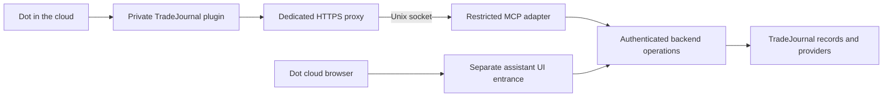

# Dots cloud MCP integration scope

**2026-10-09 — direct HTTPS D0 and sample D1 reads accepted; first demo D2 writes selected.** Isaac selected a combined
direction: the personal Dot uses structured tools for data and supported
operations, and the actual TradeJournal UI for visual inspection and workflow
feedback. This document scopes the connected-app side. The
[browser contract](cloud-browser-auth-contract.md) owns browser access; the
[Dots handoff](dots-integration.md) owns role separation and follow-through.
This is documentation work, not authorization to deploy, connect production
data, create credentials, enable schedules or spend on a new service.

**D0 implementation update:** Isaac subsequently selected the first chunk.
The [synthetic D0 runbook](cloud-mcp-d0-runbook.md) records its standalone
resource server, offline public-key verification, direct HTTPS packaging and
remaining cloud acceptance. Isaac subsequently required ChatGPT plan usage
with no API credits; direct HTTPS supersedes the earlier tunnel-first recommendation.
D1 now selects only two sample Practice reads; the
[D1 contract](cloud-mcp-d1-contract.md) records implementation and activation gates.
The remaining D1 tools, broader D2 context creation and D3 remain proposed.
The [first D2 contract](cloud-mcp-d2-contract.md) selects only saving an own
choice against existing frozen sample evidence and recovering its receipt.
Actual D1 OAuth reads and Jo's tool/cloud-UI comparison passed on 2026-10-09;
physical laptop-off D1 observation remains separate. The actual Dot has called the synthetic profile tool,
and Isaac reported the same fresh result with his Mac asleep. The runbook
separates live, fixture and user-reported evidence and remaining gates.

## Recommended shape

Create a private TradeJournal plugin backed by a **new restricted MCP adapter
on the always-on VPS**. Use ChatGPT Server URL + OAuth with a dedicated HTTPS
proxy forwarding only MCP and its metadata to a Unix socket. The D0 service
verifies tokens using an expiring operator-managed public-key file and has no
outgoing IP networking or model credentials. A separate optional unprivileged
publisher refreshes only public issuer keys on a timer; requests cannot trigger
that publisher or change their grants. No OpenAI tunnel/runtime key or
API inference is part of this route. The laptop is not a runtime dependency.

For later domain tools, both entrances must resolve to restricted application identities and the same
backend permission rules. Keep transport-specific credentials separate. The
browser session is not a connector credential, and connecting a plugin does
not sign the Dot into the website. TradeJournal remains the authority for
calculations, durable records, reveal rules and deterministic paper monitoring.
D0 contains synthetic data only and never reaches the application backend.

**No API-credit spending:** keep reasoning in Dot/ChatGPT; connector tools
return data or deterministic results. The selected D0 service has no model
keys, no model/sampling tools, no app job routes and no outgoing IP sockets.
D1 and any later UI/connector grants must also deny indirect paid model jobs;
neither a data read nor an assistant browser action may launch model
preparation. Do not add API-key authentication, API Playground tests or paid
fallbacks. Account-level purchased credits/overages are separate from API
billing and require their own usage-settings check before actual acceptance.
No connector can guarantee a product allowance or change those account limits.
Hosting/OAuth costs remain separate. See the runbook for concrete controls.

## What official documentation establishes

Sources checked 2026-10-09; these are product capabilities, not observations
of Isaac's account or this installation.

- Dots can use supported installed plugins. Their cloud browser has separate
  sessions and remains available while the user's computer is off.
  [Dots computers and apps](https://learn.chatgpt.com/docs/dots/computers-and-apps)
- ChatGPT can create a personal plugin from a custom MCP server, with read and
  write tools. Connection choices include an HTTP server URL or Secure MCP
  Tunnel; OAuth is supported. Workspace controls still apply.
  [Custom MCP servers](https://developers.openai.com/api/docs/guides/custom-mcp-server)
- Secure MCP Tunnel uses an outbound client beside the private MCP service;
  it requires a Platform tunnel, a runtime API key and appropriate organization
  and workspace access. It can target stdio or HTTP. OAuth discovery can pass
  through it, but it does not automatically make the authorization server
  reachable. Private connections do not require public plugin publication.
  [Secure MCP Tunnel](https://developers.openai.com/api/docs/guides/secure-mcp-tunnels)
- Authenticated plugin servers use OAuth 2.1, protected-resource and issuer
  metadata, and authorization code with PKCE S256. The client supports
  predefined registration as well as CIMD/DCR. Tokens need resource/audience
  validation, and tool metadata needs the appropriate security declarations.
  [Plugin authentication](https://developers.openai.com/plugins/build/auth)
- MCP Events is documented for Dots and cloud Work. It requires MCP 2.0
  (`2026-07-28`) and authenticated webhook subscriptions; this integration
  does not support the draft's polling/streaming event delivery modes.
  [MCP Events](https://developers.openai.com/plugins/build/mcp-events)

**Inference to validate:** a personal Server URL + OAuth plugin should be a
suitable Dot connection. Verify installation, discovery, OAuth and invocation
from the actual Dot before choosing it as the production transport. Local
Inspector/Codex fixtures are insufficient evidence. Check account restrictions,
plan/purchased-credit usage controls and service limits; this scope assumes
neither unlimited Dot work nor free hosting. Secure MCP Tunnel remains a
documented alternative, but is excluded from the selected no-API-credit trial.

## Existing code and the work it saves

This is an inspection of the current checkout, not a production-state audit.

| Current source | Reuse and limitation |
|---|---|
| [Local MCP adapter](../../backend/mcp_server.py) | Thin stdio adapter with market, journal and decision tools. In authenticated mode it uses the broad `manual_mcp` service capability. It is not the cloud catalog or a per-assistant credential. |
| [Access engine](../../backend/app/engine/access.py) and [route manifest](../../backend/app/access_manifest.py) | Existing assistant identity, revocation, symbol/run grants and route classification. Browser identity uses cookies plus an ingress credential; D1 adds a separate sample-only bearer path with independent token checks. |
| [Practice routes](../../backend/app/routers/practice.py) | Restricted reads filter selected runs, sanitize errors and disable read-triggered recovery. Reuse these projections; do not call an unrestricted view behind an adapter. |
| [Decision routes](../../backend/app/routers/decisions.py) | Immutable records, visibility checks and retry semantics exist. Authenticated writes currently support owner/manual MCP identities; cloud writer ownership still needs a contract and implementation. |
| [Deployment access](../../deploy/README.md#optional-browser-authentication-disabled-by-default) | Separate assistant process and secret isolation provide a pattern. Cloud MCP and its dedicated ingress are installed only in the approved synthetic trial; normal deployment keeps the manual-only templates opt-in. |
| [Backend dependencies](../../backend/pyproject.toml) | D0 now pins `mcp==1.28.1` and `PyJWT[crypto]==2.13.0`. The synthetic SDK OAuth/tool fixture negotiates `2025-11-25`; this is not MCP Events compatibility or actual Dot evidence. |

The current assistant grant contains `symbols`, `run_ids` and `journal_read`;
journal access is permitted only on an explicitly configured sample-data
installation. Preserve that limit in the first connector. A new `service=True`
identity would bypass existing symbol/run restrictions, so the new connector
must resolve to an ordinary restricted principal, not reuse `manual_mcp`.

## First usable version: selected reads

The personal Dot is a reviewer/inspector in this version. Begin on an isolated
fixture installation, then enable only explicitly granted live market symbols
and Practice runs after the live gate. No full journal export is necessary for
this slice. The D1 implementation registers the profile and two Practice reads;
the other names below remain proposed and cannot be called.

| Proposed tool | Contract and owning implementation |
|---|---|
| `get_profile()` | Return the authenticated assistant's stable opaque profile ID and display label. No caller-selected identity. Follow the documented profile-tool metadata/output shape; keep permissions out of that profile schema. |
| `get_market_snapshot(symbol)` | Bounded market-only ticker packet through the existing analysis service. Return source/capture times, units, price basis and missing/stale states. Explicit symbol grant required; no journal markers, positions or alert configuration. |
| `list_practice_runs(day)` | Bounded list of the principal's explicitly granted runs for a New York date. Reuse the restricted projection; do not silently expand the grant to all runs. |
| `get_practice_run(run_id)` | Authorized run detail with existing reveal rules and paper/practice labels. No recovery mutation, preparation, model call, reveal action or human timing changes. |
| `get_decision(record_id)` | Authorized, visible immutable decision and its frozen evidence. Reject unrelated or unrevealed records before serialization. |
| `get_paper_status(record_id)` | Authorized paper events and persisted monitoring/delivery evidence. Preserve unknown delivery/phone-receipt states; keep real journal fills and P&L outside the response. |

`practice:read` is the consented D1 permission;
`market:read` remains proposed. Effective access is the intersection of the linked connection's
OAuth grant and the current backend principal/resource grants. A token cannot
widen its principal's access. Explicit run grants will require owner updates
as new daily runs appear; an automatic rolling grant is later scope.

Use typed, bounded input/output schemas and truthful read-only annotations.
Return structured data plus brief text, stable record IDs and schema version.
Where UI inspection is useful, include a relative application path or a link
under the configured assistant UI origin; never return access-bearing links,
loopback URLs or private owner addresses as cloud navigation targets.
Market reads may use existing provider/cache paths within bounded budgets;
they may not trigger paid model preparation, imports or recomputation jobs.
Treat news and journal text as source material, never instructions.

Do not offer arbitrary HTTP, SQL, filesystem, shell, account/Gmail access,
credential management, raw health/configuration, import/rebuild, deployment,
broker execution, paper arming or policy editing tools. Every denied operation
must also fail at the backend even if the caller bypasses the advertised catalog.

## Authentication and service boundary

Use OAuth for every domain-data tool. Prefer a maintained authorization
provider/library and one predefined ChatGPT client for the first private
connection. Select the actual issuer and confirm its reachable authorization
and token endpoints during feasibility work; no existing TradeJournal OAuth
issuer is assumed. Gmail OAuth remains unrelated.

Map the validated issuer/subject and approved connection to a stored restricted
assistant principal. Consent must clearly identify that delegated profile.
Linking with the owner's account must never grant owner capabilities. This
profile is the personal coach/inspector, not an independent Shadow Isaac runner.
The same plugin may be callable from other permitted chats; do not claim OAuth
proves a particular Dot or conversation originated a request.

Design the MCP adapter and its private backend operations as one OAuth resource
boundary: the adapter passes the access token only over a fixed Unix bridge to
the isolated sample backend loopback target, which independently validates the same issuer, intended resource, expiry,
scope and principal status. Never pass it to market providers or another
resource server. Backend authorization uses the current principal grant on
every request; neither MCP discovery nor untrusted identity headers confer
access. No broad intermediary service key may substitute for that identity.

Add a distinct bearer-authenticated backend path/identity adapter without
loosening browser ingress, session or CSRF checks. Require authenticated mode
and valid configuration for connector startup; fail closed against a legacy
unauthenticated backend. Use maintained OAuth validation rather than custom
token crypto. Prove revocation at the application principal and connection
levels, including still-valid access tokens and refresh/reconnection attempts.
Keep OAuth consent/refresh state separate from assistant browser sessions.

Before real data, review the issuer/client registration, token and refresh
lifecycle, exact OAuth callback origins, mapping to application grants and
credential storage. If a public authorization service is needed, that is a
separate reviewed ingress decision. HTTPS transport does not replace OAuth
identity or application authorization.

## Deployment and operations

- Run the restricted adapter under its own VPS identity. It gets no database,
  Gmail, broker, model, owner-gateway or broad manual-MCP credentials. The
  selected D0 service has no outgoing IP sockets; issuer keys are refreshed by
  a separate operator command. Tokens never enter model arguments.
- Publish only the exact MCP/metadata paths on a dedicated HTTPS hostname,
  forwarding to its Unix socket. Never forward ports 8080/8000, an owner
  frontend, arbitrary backend paths or the existing broad adapter. D1 must
  deliberately review any new network/backend capability without introducing
  a model-provider path or credentials.
- Package opt-in services, versioned configuration and a rollback/stop path.
  Services remain disabled until the selected trial is approved. Validate
  protocol compatibility on upgrade and refuse rollback to a release without
  the connector's authorization boundary.
- Bound concurrency, body/response size, provider calls, deadlines and retries.
  Log request ID, principal, tool, resource ID, status and duration; redact
  credentials, article bodies, private URLs and detailed internal errors.
  Report connection failure as unavailable rather than using cached data as
  fresh evidence or falling back to owner access.
- Prove restart recovery, token expiration and disconnect/revoke behavior.
  Adapter/proxy failure must leave existing deterministic monitoring running.
  The browser entrance remains a separate connectivity requirement.

If the actual account cannot install/use this custom OAuth plugin, record the
limitation rather than falling back to API billing or a tunnel runtime key.
Direct HTTPS requires its own reviewed TLS/ingress deployment. Public plugin
directory distribution and an embedded ChatGPT UI are outside this scope.

## How the Dot chooses tools or the UI

Put routing guidance in MCP server instructions and individual tool descriptions.
An optional packaged skill can expand it after cloud availability is verified;
do not depend on a skill installed only on Isaac's laptop.

| User purpose | Expected route |
|---|---|
| “Review today's practice outcomes” | Read granted runs, decisions and paper events through MCP; disclose missing grants/data. |
| “Try the daily review flow and tell me what's confusing” | Navigate the actual UI with its assistant login; cite observed pages and interactions. |
| “Why does this chart disagree with the saved decision?” | Inspect the UI and retrieve frozen/current facts, comparing timestamp, source, units and price basis. |
| “Save this as your draft decision” | In an explicitly opted-in D2 demo connection, save only an own choice for an assigned frozen opportunity and return its durable receipt. D1-only connections remain read-only. |
| “Watch this and tell me when it changes” | Require a supported, explicitly established schedule/subscription with cancellation and delivery evidence; connection alone is insufficient. |

Prefer structured tools for precise records and supported mutations, UI for
visual behavior, and both when the question needs both kinds of evidence.
Do not evade a denied MCP action through the browser. On an uncertain write,
retrieve its receipt before retrying through either route. The same logical
operation must not be submitted twice via different entrances.

## Bounded implementation sequence

| Slice | Deliverable | Exit evidence |
|---|---|---|
| D0 — connection feasibility | Select issuer and tested SDK; a synthetic `get_profile` tool, restricted test identity and direct HTTPS/OAuth personal plugin on an isolated always-on host. Offline verification, no model credentials and native network denial; record account/workspace access and usage controls. | Actual Dot discovers and calls the tool after OAuth while the laptop is off; refresh, disconnect, principal revocation and expired/removed local keys behave as specified. IPv4/IPv6 creation is denied while Unix ingress works. No real journal/provider data. |
| D1 — selected reads | First increment: `get_profile`, `list_practice_runs(day)` and `get_practice_run(run_id)` for one assigned simulated MU/NBIS run; independent bearer checks, Unix bridge and manual-only packaging. Other read tools remain proposed. | Negative authorization tests, owner/browser regressions, native namespace evidence and an actual Dot reading the assigned fixture and comparing its UI. Any live data is a separate approval and later increment. |
| D2 — own draft writes | First demo increment: separately scoped `record_practice_choice` and `get_practice_choice` for existing frozen assigned opportunities. Arbitrary context creation and generic `record_agent_decision` remain later scope. | Same logical choice across UI/MCP yields one record; changed content conflicts; actor spoofing and other-principal IDs fail. Uncertain writes recover by receipt; drafts remain unarmed. |
| D3 — follow-through | One user-selected subscription or bounded schedule, not a general workflow engine. | Real event/run and cancellation, expiry, restart, duplicate delivery and revoked-resource tests; unchanged state stays quiet. |

D0's actual synthetic connection supplied the first authentication/transport
result. D1's selected sample reads completed review, CI and actual tool/UI
acceptance; D2 has its own implementation and live acceptance gates. Each slice gets its own implementation review;
this sequence does not promote writes, journal coaching or monitoring into D0/D1.

Personal journal coaching is a separately selectable extension after D1:
bounded trade summaries, statistics and explicitly shared review notes. It
requires changing the current sample-only journal grant deliberately, selecting
the permitted fields/date range and proving denial of accounts, credentials
and unrelated records. Reuse the [product roadmap](../product-roadmap.md#dots-assisted-learning-extensions-proposed)
for later reflections and commitments; do not expand the independent runner's
catalog to accommodate the personal coach.

D2 must call the existing domain validators and retain exact frozen context,
policy/provenance and immutable receipts. Creating context is a write even
though the current local tool is named `get_decision_context`. Remove the
caller-supplied actor from the cloud schema. Derive ownership and actor on the
server; bind operation keys to principal and operation. Own-draft permissions
do not authorize the human-choice, reveal, timing or phone-feedback paths.
An independent Shadow Isaac connection requires its own isolated runner and
input grants; the personal Dot cannot become independent by changing a prompt.

D3 can evaluate MCP Events after SDK/transport compatibility is demonstrated.
Keep subscriptions durable and authorized, with bounded signed webhook delivery,
safe callback validation, retry/deduplication and an observed unsubscribe path.
A later scheduled tool poll is a different fallback from MCP Events polling.
TradeJournal's price/stop/target worker remains responsible for paper outcomes.

## Acceptance and unresolved gates

Implementation checks must cover unauthenticated/expired/wrong-audience tokens,
forged identity and scopes, guessed record IDs, cross-profile access, hidden
human/agent choices, unknown tools, oversized inputs and catalog/direct-route
parity. Verify restricted market responses contain no journal overlays, and
reads neither start paid jobs nor mutate Practice state. Revoke a principal
while the connection is active and prove subsequent calls fail.

Run the repository's required verification for the implemented slice, including
existing browser/owner boundaries when authentication changes. Record fixture,
Postgres/native deployment, live provider and actual Dot evidence separately.
Test route selection with the prompts above; access-denied responses must not
cause a switch to a more privileged entrance.

The remaining environment choices are: actual account/custom-plugin eligibility,
OAuth issuer and reachability, tested SDK/protocol, isolated trial host and
data, and permission/cost limits. These are D0 investigation outputs, not
reasons to build a broad connector first. The original scoping document enabled
none of these. The subsequent approved D0 trial enabled only synthetic access;
domain tools, production grants and follow-through subscriptions remain proposed.

The selected next demo increment is [historical MCP choices](cloud-mcp-historical-contract.md):
one frozen historical assignment, shared browser receipts, and no MCP replay.
