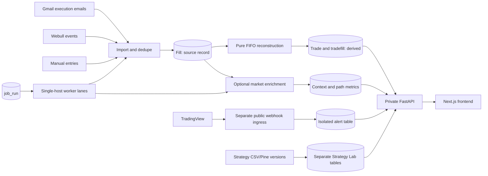

# TradeJournal interview field guide

Reviewed against repository commit `ecc1090` on 2026-10-01. This is a guide to the system and its tradeoffs, not a claim that every integration is live or that one person typed every line. Before an interview, replace the ownership prompts with what **you** personally decided, implemented, reviewed, or operated.

## The version to say out loud

**30 seconds.** “I built and operate a local-first trade journal for Robinhood and Webull history. It turns broker execution records into deterministic FIFO trades, then adds market context, analytics, charts, and research tools. The hard part was making financial data traceable and safe to recompute while running imports and enrichment against unreliable external providers. I used Python/FastAPI, SQLModel/Alembic, PostgreSQL, Next.js, CI, and a private single-server deployment.”

**90 seconds.** “The central design is that broker fills are source records and trades are derived. Gmail and Webull imports deduplicate by source identity; a pure FIFO engine reconstructs positions and P&L. I kept market enrichment nullable and versioned so an unavailable or stale number does not masquerade as a fact. Longer jobs go through database-backed `job_run` records and supervised workers. The public TradingView webhook is a separate, narrowly privileged process; the journal API stays private. Locally the app can run on SQLite without credentials; production uses PostgreSQL on a private VPS. CI tests the app, Postgres-specific behavior, browser flows, and an Ubuntu/systemd installation. I learned to separate a passing unit test from evidence that a provider, UI, or production flow actually worked.”

**Stack:** Python, FastAPI, SQLModel/SQLAlchemy, Alembic, SQLite/PostgreSQL, React/Next.js, TypeScript, Playwright, GitHub Actions, Linux/systemd, Tailscale, provider APIs.

## Architecture at a glance

The private API and frontend are reachable through private access. The optional webhook ingress exposes only its webhook and health routes. The journal, Strategy Lab simulations, and live alerts share a database but have separate data boundaries. See [architecture](agent/architecture.md), [models](../backend/app/models.py), and [ingress](../backend/app/tradingview_ingress.py).

## Decisions you should be able to explain

| Problem | Decision and reason | Cost or boundary | Where to look |
| --- | --- | --- | --- |
| Broker records can be corrected or arrive late. | Keep `fill` as source and rebuild `trade`/`tradefill` through a pure FIFO function. This makes corrected history reproducible. | A rebuild can change historical trade identity or analysis; preserve annotations where safe and mark dependent reviews stale. | [FIFO engine](../backend/app/engine/reconstructor.py), [rebuild route](../backend/app/routers/fills.py), [domain rules](agent/domain-rules.md) |
| Repeated broker notifications and ambiguous timestamps can corrupt P&L. | Deduplicate imported fills by source ID, normalize execution clocks, and specify a deterministic FIFO tie-break. | Same-timestamp events with no true broker ordering remain an ambiguity. Do not call the tie-break ground truth. | [fill model](../backend/app/models.py), [email parser](../backend/app/engine/email_parser.py), [Webull ingest](../backend/app/engine/webull.py), [FIFO engine](../backend/app/engine/reconstructor.py) |
| Historical calculations can look precise when data is missing. | Keep enrichment nullable; record calculation versions, timestamps, fingerprints, coverage and unavailable reasons. Validate important metrics with a separate Decimal ledger. | Matching computed values proves reproducibility on supplied inputs, not broker completeness or market-data accuracy. | [metric correctness](trade-metric-correctness.md), [reference math](../backend/app/engine/metric_reference.py), [validator](../backend/scripts/validate_trade_metrics.py) |
| API requests should not own long imports or provider waits. | Commit a `job_run`, then let single-host worker lanes claim and execute it with database status plus local kernel locks. | Requires one shared host and lock directory. Interrupted work is marked failed for inspection, not automatically replayed when side effects may have happened. | [job runtime](../backend/app/engine/job_runtime.py), [job operations](agent/background-jobs.md) |
| A public webhook must not expose an unauthenticated journal API. | Run TradingView ingress as a separate FastAPI app, on its own port and OS/DB role, with a narrow route and import allowlist. | This protects a single-user private deployment; it is not a general multi-user auth system. | [ingress](../backend/app/tradingview_ingress.py), [role setup](../backend/scripts/setup_roles.py), [import-boundary test](../backend/tests/test_import_boundaries.py) |
| Development SQLite and production PostgreSQL behave differently. | Use Alembic as the only schema authority; fail startup when the DB is not at head; run Postgres parity, migration-path and privilege tests in CI. | A local SQLite pass cannot prove Postgres behavior. Schema releases require an operator and a verified backup. | [schema guard](../backend/app/schema.py), [CI](../.github/workflows/ci.yml), [deployment guide](../deploy/README.md) |
| The server is private and cannot receive a GitHub deployment push. | Publish a build only after CI and Ubuntu installation smoke tests pass; let the VPS pull a verified release, check health, and retain rollback. | Schema changes, running jobs and market hours can hold activation. Rollback of code cannot undo a schema change or lost writes. | [release gate](../.github/workflows/release.yml), [autodeploy](../deploy/autodeploy.py), [deployment guide](../deploy/README.md) |
| “Market data” serves different uses. | Keep fill-time enrichment, live quotes, and chart history on separate paths. Charts use Tradier for today/live and explicit Alpaca SIP/raw requests for completed intraday sessions. | Provider clocks, licensing, gaps and feed differences must be disclosed; do not silently splice a forming day into completed history. | [chart design](charts-workspace.md), [history code](../backend/app/engine/chart_history.py), [chart API](../backend/app/routers/charts.py) |
| Simulated strategy results could be mistaken for executed trades. | Keep Strategy Lab tables separate; bind a CSV import to its source bytes, source timezone and version fingerprint through preview/commit. | A backtest is a simulation. Its metrics disclose missing coverage and do not establish a profitable trading edge. | [Strategy Lab route](../backend/app/routers/strategy_lab.py), [models](../backend/app/models.py), [metrics rules](strategy-lab-metrics.md) |

## Three stories to practice

Use **situation → decision → action → evidence → what you would change**. Interviewers often ask what *you* did and why; [Amazon's published SDE guidance](https://www.amazon.jobs/content/en/how-we-hire/sde-ii-interview-prep) explicitly asks for the what, how, why, and specific evidence. Fill in your own role before using these as first-person answers.

### 1. “Tell me about a correctness bug you found.”

**Good example: historical trade metrics.** A plausible-looking P&L or peak can be wrong after partial exits. The calculation now walks quantity and cost basis through FIFO events; historical minute bars are treated as observed estimates, not executable prices. Unavailable inputs remain null. A separate reference implementation and test cases challenge the production math. For a concrete example, the [metric document](trade-metric-correctness.md) shows why applying a later price to all original contracts exaggerates peak P&L. Explain which defect you personally found, what evidence contradicted the original number, and whether you participated in the production recomputation.

**Follow-up to expect:** “If both implementations agree, how do you know the broker data is complete?” Answer: you do not; reconcile source records against broker exports and preserve provider provenance. The independent validator checks calculations over given evidence.

### 2. “How did you keep background work safe through restarts?”

**Good example: worker ownership.** The API commits a queued job before a worker starts. A worker conditionally moves it to running and holds a local kernel lock for the entire execution. A restart leaves queued work eligible; a dead owner’s running job becomes failed with an explicit warning about partial effects. Provider calls, resyncs and paid analysis are not blindly replayed. Explain why this simpler single-host model fit the deployment and when you would replace it with a distributed queue. See [job runtime](../backend/app/engine/job_runtime.py) and [recovery procedure](agent/background-jobs.md).

**Follow-up to expect:** “What happens if the worker dies after committing fills but before rebuilding trades?” Answer: inspect the failed run; source ID dedupe makes reimport safe, then explicitly rebuild derived trades before enrichment. The system does not pretend that every step was an atomic transaction.

### 3. “How did you release safely?”

**Good example: private deployment and database cutover.** A package is built away from production and smoke tested on Ubuntu with disposable Postgres and systemd. A green `main` commit is published as a verified release; the private VPS pulls it. Activation checks health and can roll code back if the schema still permits it. The [cutover record](../deploy/README.md#production-database-cutover-2026-09-23) describes stopping writers, checking a dump and restore, comparing table counts/revision, switching roles and connections, and drilling backup/restore. Explain your exact operator role and evidence; do not imply that switching back to the old Neon snapshot would preserve newer VPS writes.

**Follow-up to expect:** “Why not deploy automatically during market hours or through a migration?” Answer: a service restart can miss an alert; running jobs may have side effects; schema changes deserve a verified backup and a human decision. The tradeoff is slower delivery for those cases.

## Technical questions you should answer without notes

1. Walk through one Robinhood email or Webull event from receipt to a visible trade. Where are duplicates stopped?
2. How does FIFO handle scale-ins, partial exits, short options and equal timestamps? Which outcomes are still ambiguous?
3. Why store money as `Decimal` in calculation, and how does SQLite storage differ from PostgreSQL? See `ExactDecimal` in [models](../backend/app/models.py).
4. What would go wrong if the TradingView ingress imported the private API or used its unrestricted database credentials?
5. What do `job_run` and the file lock each protect? Why does this design require one host?
6. What can local `verify.sh` prove, and what do Postgres CI, browser tests, Ubuntu smoke and a live-provider check add?
7. How would you investigate a chart showing stale or mixed-provider prices? Explain SSE, REST reconciliation, SIP history and visible source labels.
8. What is safe to rebuild, what is the source of truth, and what must be backed up before a destructive operation?
9. How do you stop a backtest or AI review from being presented as observed trading performance?

## How to frame your role honestly

“I set the requirements and architecture boundaries, used Codex and Claude to accelerate implementation, reviewed their diffs, investigated failures, and required tests and operational evidence before accepting changes” is a strong account **if it matches what you did**. Say which parts you wrote directly, which you directed or reviewed, and which you operated in production. Be ready to open the code and reason through one of the difficult paths above without an agent.

Avoid claims the repository cannot prove: enterprise scale, multi-user security, a validated trading edge, complete broker reconciliation, flawless live feeds, or a performance improvement without before/after measurements. This is a single-user, private deployment with a deliberately single-host job design. The [verification guide](agent/verification.md) explicitly separates tests from live-provider and production evidence.

## What the project demonstrates, and what you could improve

**Strong evidence:** full-stack integration, financial-data modeling, deterministic reconstruction, idempotent ingestion, operational recovery, least-privilege public ingress, provider-aware UI, real database testing, and careful release gates. The repo has focused tests for the riskiest boundaries and a code map that connects screens to routes and proof.

**Candid next steps:** simplify the amount of process used for a small change; add team review and branch protection if other developers join; introduce explicit user auth before widening access; measure customer usage, latency, provider cost and failure rates before claiming product or scale impact. The current single-host locks are a conscious fit for this deployment, not a distributed-work solution.

**Concrete debt I found in this checkout:** `backend/app/main.py` still normalizes a specific Roth account and can rebuild trades during startup. That belongs in an explicit, observable data migration or repair path before the app becomes multi-user. Documentation checks catch broken links, but not every stale sentence: `README.md`'s Quick Start implies the TradingView ingress starts by default while `startdev.sh` makes it opt-in, and `docs/agent/architecture.md` says the autodeploy timer is five minutes while its systemd timer runs every three. These are useful examples of why operational documentation needs periodic review against executable behavior.

## Resume bullets to adapt

- Built a local-first trading journal that imports broker execution records and reconstructs stocks/options trades with deterministic FIFO accounting, deduplication and reconciliation workflows.
- Designed single-host background execution with persistent job state, worker lanes and crash recovery for import, enrichment and provider listeners.
- Isolated an external webhook behind a restricted application and database role while keeping the journal API private.
- Added Postgres migration/role checks, browser tests and Ubuntu installation smoke tests to a release pipeline with health checks and guarded rollback.
- Improved historical metric trust by tracking calculation provenance, missing coverage and stale results, and comparing selected calculations against an independent reference implementation.

Use only bullets whose design, implementation, validation and outcome you can explain. Add real measurements you personally verified; do not invent users, revenue, speedups or error reductions.

## Your five-minute pre-interview checklist

1. Pick **two** stories above that match the job, and write your personal contribution in one sentence for each.
2. For each, name one rejected alternative and the actual tradeoff (for example, file locks versus a distributed queue).
3. Bring one concrete failure, the diagnostic evidence, the fix, and the proof that the fix caught the defect.
4. Know one limitation you would address next if the app gained multiple users or a second server.
5. Refresh current production, CI and provider status before claiming something is live; this guide only verifies repository design at the commit shown above.
